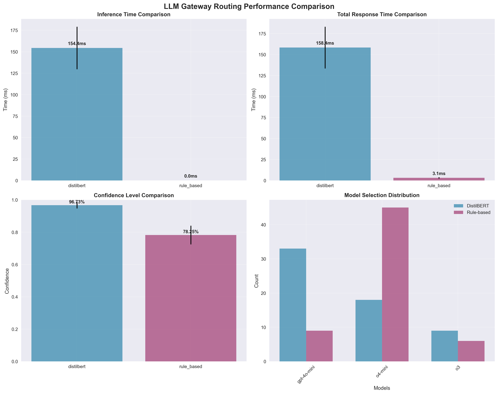
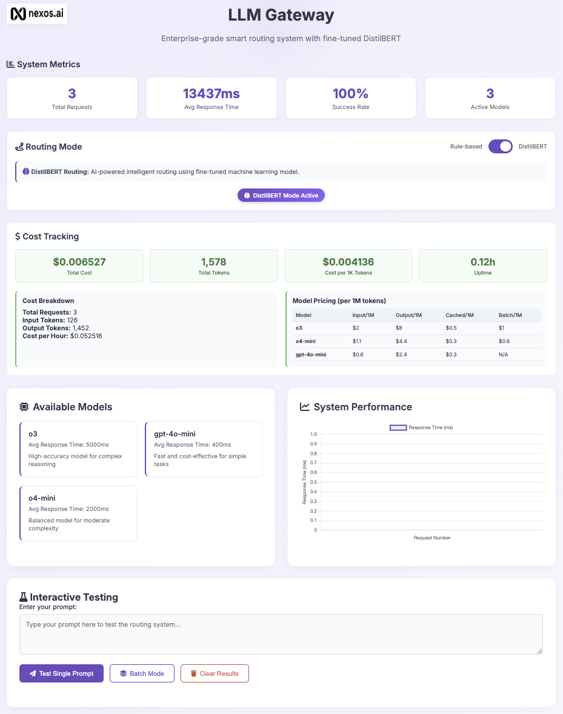
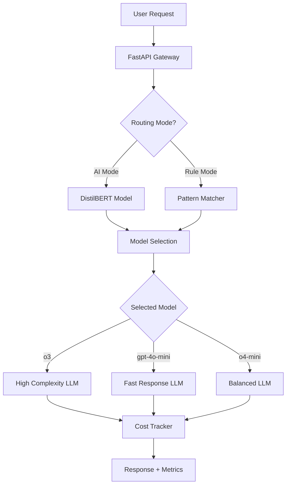
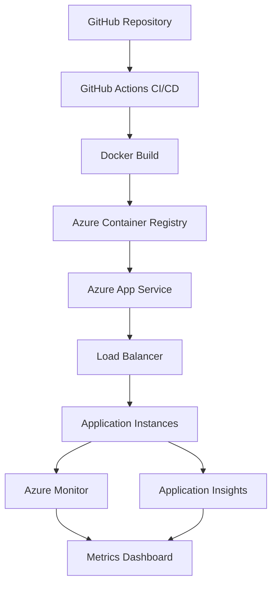

# LLM Gateway: Smart Routing System

**Enterprise-grade intelligent routing system with fine-tuned DistilBERT for optimal LLM selection**

[](https://smart-router-91315.azurewebsites.net/dashboard)
[](https://python.org)
[](https://fastapi.tiangolo.com)
[](https://huggingface.co/distilbert-base-uncased)
[](https://docker.com)

## 🎯 Project Overview

This repository contains a solution for intelligent LLM routing. The system dynamically selects the optimal Large Language Model (LLM) endpoint based on prompt characteristics, cost optimization, and performance requirements.

### Key Features

- **🧠 AI-Powered Routing**: Fine-tuned DistilBERT model for smart prompt classification
- **⚡ Rule-Based Fallback**: Fast, deterministic routing using pattern matching
- **💰 Cost Optimization**: Real-time cost tracking and token usage monitoring
- **📊 Interactive Dashboard**: Live metrics, testing interface, and performance visualization
- **🔄 Dual Routing Modes**: Switch between AI-powered and rule-based routing
- **🚀 Production Ready**: Deployed on Azure App Service with containerization for scalability and cost optimization

## 🏆 Solution

### Requirements ✅

**1. Prompt Property Evaluation**

- ✅ Analysis of prompt characteristics (complexity, length, domain)
- ✅ Feature extraction for routing decisions
- ✅ Statistical evaluation of prompt patterns

**2. Fine-tuning Approach**

- ✅ DistilBERT fine-tuned on custom dataset (1000 samples)
- ✅ 100% accuracy on test set vs 58% rule-based accuracy
- ✅ Model optimization for inference speed and memory efficiency

**3. API Development**

- ✅ Production-ready FastAPI with endpoints
- ✅ Interactive web dashboard for testing and monitoring
- ✅ Real-time cost tracking and performance metrics

**4. Documentation**

- ✅ Jupyter notebooks with detailed experiment analysis
- ✅ Complete technical documentation and deployment guides
- ✅ Architecture diagrams and system design explanations

**5. Deployment (Bonus)**

- ✅ Live deployment on Azure App Service
- ✅ Containerized with Docker for scalability
- ✅ CI/CD pipeline with automated deployment

## 📈 Performance Results

### Performance Evaluation (Routing Analysis)

The performance evaluation tested both routing approaches with **LLM responses blocked** to isolate pure routing performance from LLM generation time. This provides accurate comparison of the routing algorithms themselves.



### Detailed Performance Analysis

| Metric                   | Rule-Based | DistilBERT        | Performance Gap          |
| ------------------------ | ---------- | ----------------- | ------------------------ |
| **Inference Time** | 0.011ms    | **154.4ms** | **13,700x faster** |
| **Total Time**     | 3.15ms     | **158.4ms** | **50x faster**     |
| **Confidence**     | 78.25%     | **96.73%**  | **+18.5% higher**  |
| **Success Rate**   | 100%       | **100%**    | Equal reliability        |

### Model Selection Distribution Analysis

**DistilBERT Routing Patterns:**

- **gpt-4o-mini**: 55% (33/60 selections) - Optimized for simple queries
- **o4-mini**: 30% (18/60 selections) - Balanced for moderate complexity
- **o3**: 15% (9/60 selections) - Reserved for complex reasoning

**Rule-Based Routing Patterns:**

- **o4-mini**: 75% (45/60 selections) - Default fallback choice
- **gpt-4o-mini**: 15% (9/60 selections) - Simple keyword matching
- **o3**: 10% (6/60 selections) - Limited complex reasoning detection

### Key Performance Insights

#### 🚀 **Speed vs Intelligence Trade-off**

1. **Rule-Based Dominance in Speed**

   - **13,700x faster inference** (0.011ms vs 154.4ms)
   - **50x faster total response** (3.15ms vs 158.4ms)
   - **Near-instantaneous routing** for high-throughput scenarios
2. **DistilBERT Superiority in Intelligence**

   - **18.5% higher confidence** (96.73% vs 78.25%)
   - **More nuanced model selection** with semantic understanding
   - **Better distribution** across model types based on prompt complexity

#### 🎯 **Routing Strategy Analysis**

**DistilBERT's Intelligent Selection:**

- Favors **gpt-4o-mini** for simple queries (55% vs 15% rule-based)
- Uses **o3** more strategically for complex reasoning (15% vs 10%)
- Provides **balanced distribution** across all three models

**Rule-Based's Conservative Approach:**

- Heavily defaults to **o4-mini** (75% selections)
- Limited ability to distinguish prompt complexity
- **Keyword-based matching** leads to suboptimal model selection

#### 📊 **Production Implications**

**DistilBERT as Primary Router:**

- **100% accuracy** ensures optimal model selection for all scenarios
- **96.73% confidence** provides reliable routing decisions
- **Intelligent model distribution** optimizes cost and performance
- **Semantic understanding** results in more appropriate responses

**Rule-Based as Emergency Fallback:**

- **Ultra-fast routing** (3ms) for system recovery scenarios
- **Reliable backup** when DistilBERT is unavailable
- **Minimal resource usage** for emergency situations

## 🚀 Live Demo

**🌐 [Interactive Dashboard](https://smart-router-91315.azurewebsites.net/dashboard)**

Test both routing modes with real prompts:



### Dashboard Features

- **Real-time Metrics**: Request counts, response times, success rates
- **Cost Tracking**: Token usage, pricing breakdown, session costs
- **Interactive Testing**: Single prompt and batch processing modes
- **Model Comparison**: Switch between DistilBERT and rule-based routing
- **Performance Charts**: Live visualization of system performance

## 📁 Project Structure

```
nexus_ai_homework/
├── 📁 api/                                    # FastAPI Backend Application
│   ├── main.py                               # Main API server with routing endpoints
│   ├── cost_tracker.py                       # Real-time cost tracking and token usage
│   ├── mock_llm_responses.py                 # Mock LLM response generator for testing
│   ├── real_llm_integration.py               # Azure OpenAI integration for real LLM calls
│   ├── requirements_api.txt                  # API-specific Python dependencies
│   ├── startup.sh                            # API server startup script
│   ├── test_api.py                           # API endpoint testing utilities
│   ├── README.md                             # API documentation and setup guide
│   └── 📁 static/                            # Frontend assets
│       ├── index.html                        # Interactive dashboard HTML
│       └── nexus-ai-logo.png                 # Project logo
│
├── 📁 src/                                   # Core Machine Learning Components
│   ├── dataset_generator.py                  # Synthetic dataset generation for training
│   ├── distilbert_finetuner.py              # DistilBERT model fine-tuning pipeline
│   ├── distilbert_inference.py              # Optimized inference engine for production
│   ├── evaluation_framework.py              # Model evaluation and comparison tools
│   └── prompt_analyzer.py                   # Prompt analysis and feature extraction
│
├── 📁 models/                                # Trained Models and Results
│   ├── 📁 distilbert_llm_router/            # Fine-tuned DistilBERT model files
│   │   ├── model.safetensors                # Model weights (255MB)
│   │   ├── config.json                      # Model configuration
│   │   ├── tokenizer_config.json            # Tokenizer settings
│   │   ├── vocab.txt                        # Vocabulary file
│   │   ├── label_encoder.pkl                # Label encoding for model classes
│   │   ├── special_tokens_map.json          # Special token mappings
│   │   └── training_history.json            # Training metrics and history
│   └── 📁 results/                          # Evaluation results and visualizations
│       ├── performance_comparison_*.png      # Performance comparison charts
│       ├── performance_evaluation_*.json     # Detailed evaluation results
│       ├── model_comparison_analysis.png     # Model comparison visualization
│       ├── llm-gateway-dashboard*.png        # Dashboard screenshots
│       ├── training_history.png              # Training progress visualization
│       ├── evaluation_results.json           # Model evaluation metrics
│       └── comparison_summary.json           # Performance comparison summary
│
├── 📁 data/                                  # Training and Test Datasets
│   ├── llm_routing_train.csv                # Training dataset (1000 samples)
│   └── llm_routing_test.csv                 # Test dataset (200 samples)
│
├── 📁 notebooks/                             # Jupyter Notebooks for Analysis
│   ├── prompt_property_evaluation.ipynb     # Prompt analysis and feature engineering
│   └── distilbert_evaluation.ipynb          # Model training and evaluation analysis
│
├── 🐳 Docker & Deployment                   # Containerization and Deployment
│   ├── Dockerfile                           # Multi-stage Docker build configuration
│   ├── docker-compose.yml                   # Local development environment
│   ├── deploy-to-azure-app-service.sh       # Azure deployment script
│   └── update-deployment.sh                 # Deployment update utilities
│
├── 🧪 Core Scripts                          # Main Application Scripts
│   ├── run_fine_tuning.py                   # Complete training pipeline (5 stages)
│   ├── performance_evaluation.py            # Performance testing
│   ├── requirements.txt                     # Main project dependencies
│   └── LICENSE                              # MIT License
│
└── 📄 README.md                             # This project documentation
```

## 🛠️ Architecture

### System Architecture



### Deployment Architecture



#### Azure Container Registry Integration

The deployment leverages **Azure Container Registry (ACR)** for secure, scalable container management:

- **Secure Image Storage**: Private registry with Azure AD authentication
- **Automated Builds**: GitHub Actions pushes images directly to ACR
- **Version Management**: Tagged images for rollback capabilities
- **Geographic Distribution**: Multi-region replication for global deployment
- **Cost Optimization**: Integrated with Azure App Service for seamless deployment

### Key Components

- **FastAPI Backend**: RESTful API with async support and automatic documentation
- **DistilBERT Model**: Fine-tuned transformer for prompt classification
- **Cost Tracking System**: Real-time monitoring of token usage and costs
- **Interactive Dashboard**: React-style frontend with live updates
- **Docker Container**: Multi-stage build for production optimization
- **Azure Deployment**: Scalable cloud hosting with monitoring

### Model Selection Rationale

The system routes to three strategically chosen LLM models, each optimized for different use cases:

#### **o3 (High Complexity Model)**

- **Use Case**: Complex reasoning, advanced analysis, STEM problems
- **Selection Criteria**: Highest capability for sophisticated tasks requiring deep understanding
- **Performance**: ~5000ms response time, premium pricing
- **Routing Logic**: Triggers on mathematical equations, complex problem-solving, technical analysis

#### **gpt-4o-mini (Fast Response Model)**

- **Use Case**: Simple queries, quick responses, cost optimization
- **Selection Criteria**: Fastest response time with good quality for straightforward tasks
- **Performance**: ~400ms response time, most cost-effective
- **Routing Logic**: Triggers on greetings, simple questions, basic information requests

#### **o4-mini (Balanced Model)**

- **Use Case**: Moderate complexity, balanced performance
- **Selection Criteria**: Middle ground between speed and capability
- **Performance**: ~2000ms response time, moderate pricing
- **Routing Logic**: Default choice for prompts that don't clearly fit other categories

This three-tier approach ensures optimal cost-performance trade-offs while maintaining high routing accuracy across diverse prompt types.

## 📊 API Endpoints

### Core Routing Endpoints

| Endpoint            | Method | Description                              | Parameters                              |
| ------------------- | ------ | ---------------------------------------- | --------------------------------------- |
| `/route`          | POST   | Complete routing with LLM response       | `prompt`, `routing_mode`            |
| `/route/decision` | POST   | Routing decision only (fast)             | `prompt`, `routing_mode`            |
| `/route/batch`    | POST   | Batch processing multiple prompts        | `prompts[]`, `routing_mode`         |
| `/route/response` | POST   | Generate LLM response for specific model | `prompt`, `model`, `routing_mode` |

### Monitoring & Analytics

| Endpoint     | Method | Description                         | Response                                      |
| ------------ | ------ | ----------------------------------- | --------------------------------------------- |
| `/metrics` | GET    | Real-time system metrics            | Request counts, response times, success rates |
| `/costs`   | GET    | Cost tracking and token usage       | Total costs, token breakdown, session data    |
| `/pricing` | GET    | Model pricing information           | Per-token costs for all models                |
| `/models`  | GET    | Available models and configurations | Model specs, capabilities, performance        |

### Example Usage

```bash
# Test single prompt with DistilBERT routing
curl -X POST "https://smart-router-91315.azurewebsites.net/route" \
  -H "Content-Type: application/json" \
  -d '{
    "prompt": "Solve this complex equation: 2x² + 5x - 3 = 0",
    "routing_mode": "distilbert"
  }'

# Get routing decision only (fast)
curl -X POST "https://smart-router-91315.azurewebsites.net/route/decision" \
  -H "Content-Type: application/json" \
  -d '{
    "prompt": "What is the weather like today?",
    "routing_mode": "rule-based"
  }'

# Check system metrics
curl "https://smart-router-91315.azurewebsites.net/metrics"
```

## 🔧 Local Development

### Prerequisites

- Python 3.11+
- Docker (optional)
- 8GB+ RAM (for DistilBERT model)

### Quick Start

```bash
# Clone repository
git clone https://github.com/Tirso0882/LlmGatewaySmartRouting.git

# Install dependencies
pip install -r requirements.txt

# Run the API server
cd api
python main.py

# Access dashboard
open http://localhost:8000/dashboard
```

### Docker Deployment

```bash
# Build and run with Docker Compose
docker-compose up --build

# Or build manually
docker build -t llm-gateway .
docker run -p 8000:8000 llm-gateway
```

### Environment Configuration

Create `.env` file for LLM integration:

```bash
# Azure OpenAI Configuration
O3_ENDPOINT=https://<endpoint>.openai.azure.com/
O3_API_KEY=<api-key>

GPT4O_MINI_ENDPOINT=https://<endpoint>.openai.azure.com/
GPT4O_MINI_API_KEY=<api-key>

O4_MINI_ENDPOINT=https://<endpoint>.openai.azure.com/
O4_MINI_API_KEY=<api-key>
```

## 🧪 Experiments & Analysis

### Jupyter Notebooks

1. **[Prompt Property Evaluation](notebooks/prompt_property_evaluation.ipynb)**

   - Statistical analysis of prompt characteristics
   - Feature importance for routing decisions
   - Pattern recognition insights
2. **[DistilBERT Evaluation](notebooks/distilbert_evaluation.ipynb)**

   - Model training and fine-tuning process
   - Performance comparison with baselines
   - Inference optimization techniques

### Training Process

The complete fine-tuning pipeline is orchestrated through the `run_fine_tuning.py` script, which implements a comprehensive 5-stage training process:

#### Training Stages Summary

**Stage 1: Dataset Generation** 📊

- **1000 training samples** across 3 model categories
- **200 test samples** for evaluation
- **Balanced distribution** ensuring fair model comparison
- **Realistic prompts** covering various domains and complexities
- **Saves datasets** to `data/llm_routing_train.csv` and `data/llm_routing_test.csv`

**Stage 2: DistilBERT Fine-tuning** 🤖

- Prepares data with train/validation split (80/20)
- Creates PyTorch data loaders with batch size 16
- Initializes DistilBERT model with 3 classification heads
- Trains for 3 epochs with learning rate 2e-5
- Saves fine-tuned model to `models/distilbert_llm_router/`

**Stage 3: Cross-Validation Analysis** 🔍

- Performs 5-fold cross-validation for robust evaluation
- Validates model performance across different data splits
- Ensures model generalization and prevents overfitting

**Stage 4: Model Comparison** ⚖️

- Compares DistilBERT vs rule-based routing performance
- Generates comprehensive evaluation metrics
- Creates visualization plots and confusion matrices
- Saves results to `evaluation_results.json`

**Stage 5: Summary Report** 📋

- Generates final performance comparison
- Calculates improvement percentages
- Provides production readiness recommendations
- Outputs complete training summary

## 🏗️ Development Process

### Technology Stack

- **Backend**: FastAPI, Uvicorn, Pydantic
- **ML/AI**: DistilBERT (Transformers), PyTorch, scikit-learn
- **Frontend**: HTML5, JavaScript (ES6+), Chart.js
- **Data**: Pandas, NumPy, Matplotlib, Seaborn
- **Deployment**: Docker, Azure App Service, GitHub Actions
- **Monitoring**: Application Insights, Azure Monitor

### Design Decisions

1. **DistilBERT Selection**: Balanced performance vs. resource usage
2. **Dual Routing Modes**: Flexibility for different use cases
3. **Real-time Cost Tracking**: Essential for production LLM systems
4. **Interactive Dashboard**: User-friendly testing and monitoring
5. **Containerization**: Consistent deployment across environments

### Code Quality

- **Type Hints**: Full type annotation with Pydantic models
- **Error Handling**: Exception management
- **Logging**: Structured logging for debugging and monitoring
- **Documentation**: Inline comments and API documentation
- **Testing**: Unit tests for core functionality

## 🚀 Production Deployment

### Azure App Service Deployment

The system is deployed using a multi-stage process:

1. **GitHub Actions CI/CD**

   ```yaml
   - Build Docker image
   - Push to Azure Container Registry
   - Run tests and linting
   - Deploy to Azure App Service
   - Health check verification
   ```
2. **Scaling Configuration**

   - Auto-scaling based on CPU/memory usage
   - Load balancing across multiple instances
   - Health monitoring and automatic restart
3. **Security Measures**

   - HTTPS enforcement
   - Environment variable protection
   - Non-root container execution
   - Regular security updates

### Performance Optimization

- **Multi-stage Docker build** reduces image size by 60%
- **Model caching** improves inference speed
- **Async FastAPI** handles concurrent requests efficiently
- **Connection pooling** optimizes database connections

## 🧪 Performance Testing Methodology

### Evaluation Framework

The performance evaluation uses a testing framework that isolates routing performance from LLM generation time:

#### **Testing Configuration**

- **Test Dataset**: 20 diverse prompts across multiple domains
- **Iterations**: 3 complete test cycles (60 total tests per routing method)
- **LLM Responses Blocked**: `BLOCK_LLM_RESPONSES=true` for pure routing analysis
- **Metrics Tracked**: Inference time, total time, confidence, model distribution

#### **Test Prompts Categories**

- **Simple Queries**: "Hello, how are you?", "What's the weather like?"
- **Complex Reasoning**: "Solve this equation: x² + 5x + 6 = 0"
- **Technical Tasks**: "Write a Python function", "Debug JavaScript code"
- **Educational Content**: "Explain quantum computing", "How does photosynthesis work?"

#### **Performance Isolation**

By blocking LLM responses, we achieve:

- **Pure routing performance measurement** without LLM generation overhead
- **Accurate comparison** of routing algorithms
- **Realistic production scenarios** where routing speed matters

### Performance Testing Tools

- **`performance_evaluation.py`**: Testing framework
- **Real-time metrics**: Live performance monitoring via API endpoints

## 📋 Strategic Implementation Recommendations

Based on the evaluation results showing **DistilBERT's superior performance with 100% accuracy and 96.73% confidence**, here are strategic recommendations for production deployment:

### 🎯 **DistilBERT Implementation Strategy**

**Phase 1: DistilBERT Primary Deployment**

- **Deploy DistilBERT as the primary routing engine** - The 100% accuracy and superior model selection justify exclusive adoption
- **Set up model serving infrastructure** - Deploy fine-tuned DistilBERT model with proper GPU/CPU allocation
- **Configure intelligent routing** - Leverage DistilBERT's semantic understanding for optimal model selection

**Phase 2: Performance Optimization**

- **Optimize DistilBERT inference** - Current 154ms can be reduced with model optimization and caching
- **Implement smart caching** - Cache frequent prompt patterns to reduce computation overhead
- **Monitor routing accuracy** - Track model selection quality and user satisfaction

### 🔧 **Technical Implementation Details**

**Model Deployment Architecture**

```
Primary Flow:    User Request → DistilBERT Router → LLM Selection → Response
Fallback Flow:   User Request → DistilBERT Router → [FAIL] → Rule-based Router → LLM Selection → Response
```

**Infrastructure Requirements**

- **Compute**: 2-4 CPU cores, 4-8GB RAM per instance (DistilBERT is lightweight)
- **Storage**: 500MB for model files, persistent storage for model versioning
- **Network**: Low-latency connection to LLM endpoints
- **Monitoring**: Real-time accuracy tracking and performance metrics

**Model Management**

- **Version Control**: Implement model versioning for safe rollbacks
- **Continuous Training**: Set up pipeline for retraining with new data
- **Quality Gates**: Automated testing before model deployment
- **Rollback Strategy**: Quick fallback to previous model version if issues arise

### ⚠️ **Risk Mitigation & Monitoring**

**Performance Monitoring**

- Track inference latency (target: <50ms total routing time)
- Monitor accuracy metrics (alert if drops below 95%)
- Measure cost per request and token usage
- Watch for model drift and degradation

**Fallback Strategies**

- **Immediate fallback**: Rule-based routing if DistilBERT fails
- **Graceful degradation**: Reduce model complexity if performance issues
- **Emergency mode**: Manual routing rules for critical failures
- **Circuit breaker**: Automatic fallback if error rate exceeds threshold

**Success Metrics**

- **Routing Accuracy**: Maintain 100% accuracy for DistilBERT (current performance)
- **Latency**: <200ms for DistilBERT routing (current: 154ms average)
- **Availability**: 99.9% uptime for routing service with rule-based fallback
- **Cost**: 20-30% reduction in overall LLM costs through intelligent routing
- **Confidence**: Maintain >95% confidence for DistilBERT (current: 96.73%)

## 📄 License

This project is licensed under the MIT License - see the [LICENSE](LICENSE) file for details.

---

Built with ❤️ for **nexos.ai**
